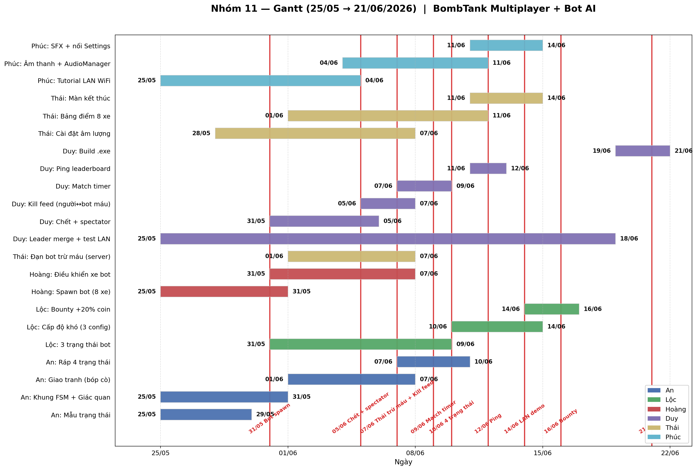

# Nhóm 11 — Ai làm gì (chỉ phần CODE)

**Bắt đầu:** 25/05/2026 · **Hạn:** 21/06/2026  
**Mục tiêu chung:** đồ án có AI — game đã có sẵn (tank LAN bắn nhau), nhóm thêm **bot tự chơi** + vài thứ làm game "đầy đủ" (cài đặt, âm thanh, màn kết thúc).

**Sơ đồ Gantt:**



*Máu / combat hai chiều trên Gantt: **Thái: Đạn bot trừ máu (server)** + **Duy: Kill feed**. Mốc **07/06**.*

**Quy tắc Git:**

- Ai cũng làm trên nhánh riêng. **Chỉ Duy** gộp vào `main`. Không ai tự gộp.
- **Duy duyệt** nhánh khi: kéo về máy chạy thử **không lỗi** + làm **đúng việc đã giao** trong file này.
- Nếu chạy lỗi hoặc làm thiếu → Duy báo lại trên nhóm, người đó sửa rồi push tiếp.

**Công cụ chung của nhóm:**

- **Zalo nhóm**: báo tiến độ hằng ngày 1 dòng, hỏi khi kẹt.
- **GitHub** (repo của Duy): nơi push code và xem ai đang làm nhánh gì.
- **Họp 15 phút/tuần** (online hoặc trực tiếp): mỗi người nói đang làm tới đâu.

---

## 1. Thứ tự làm (ai cần ai)

```
Hoàng (spawn + điều khiển xe — bóp cò gọi API Thái) ──────────┐
                                                               ├─► Đánh nhau thật ──► Duy test LAN
An + Lộc (bot brain — 4 trạng thái, Giao tranh bóp cò) ───────┘         Kill feed cần credit 2 chiều

Thái (đạn trừ máu server + Settings + Bảng điểm + Màn kết thúc) ─ Bảng điểm chờ nhãn bot Hoàng
Phúc (Tutorial + Âm thanh + Hiệu ứng SFX)   ─── làm song song, cuối nối nhạc với Settings của Thái
```

**Mấu chốt:** Hoàng spawn bot xong (31/05) là "cú mở khoá" cho An/Lộc. Combat phải **hai chiều trên server** — **Thái** làm phần đạn/sát thương:
- **Bot bắn → người/bot mất máu** (Thái: spawn `ServerDanPrefab` khi brain bóp cò + `SetOwner(bot)`).
- **Người thật bắn → bot mất máu, chết được** (Thái kiểm tra pipeline `BoPhongDan` + team/collider; Duy giữ `mau.cs` / kill credit).

Hoàng chỉ **spawn + điều khiển** (đi, ngắm, chuyển tín hiệu bóp cò). An+Lộc bot brain; Duy kill feed + respawn.

---

## 2. Mỗi người làm gì

### Lộc — 3 trạng thái bot + Cấp độ khó + Bounty

**Nhánh:** `feature/bot-state-easy`, `feature/bot-difficulty`, `feature/bounty-system`  
**Hạn:** 3 trạng thái 09/06 · Cấp độ khó 14/06 · Bounty 16/06  
**Chú ý:** cấp độ khó **không cần UI chọn** — Hoàng sẽ random gán lúc spawn bot (mỗi trận đủ Dễ/Trung/Khó). Lộc chỉ cần làm 3 file config + chỉnh bot brain đọc số từ config.  
**Phụ thuộc:** 

- An đưa **ví dụ trạng thái mẫu trước 29/05** → Lộc đọc trước, đỡ bỡ ngỡ.
- An xong **Khung FSM + Giác quan** trước 31/05 → Lộc bắt đầu code 3 trạng thái.
- Hoàng xong spawn bot trước 31/05 → Lộc có xe bot trên map để test.  
**Cần làm:**

#### 1. Ba trạng thái bot (31/05 → 09/06) — `feature/bot-state-easy`


| Trạng thái    | Khi nào              | Bot làm gì                                                               |
| ------------- | -------------------- | ------------------------------------------------------------------------ |
| **Tuần tra**  | Không có địch gần    | Đi loanh quanh tới 1 điểm random trên map, tới nơi thì chọn điểm khác    |
| **Nhặt coin** | Thiếu coin để bắn    | Lấy coin gần nhất từ Giác quan, đi tới đó                                |
| **Rút lui**   | Máu thấp (vd: < 30%) | Chạy ra xa địch gần nhất, tìm chỗ né (chọn điểm xa địch nhất quanh mình) |


Cả 3 trạng thái về bản chất đều là **"đi tới 1 điểm"** — chỉ khác cách chọn điểm. Mỗi trạng thái là 1 file riêng theo mẫu của An, có hàm `Update(thông tin môi trường) → lệnh (move/aim/fire)`.

**Bàn giao cho An:** đưa 3 file trạng thái → An ráp vào khung FSM (~10/06).

#### 2. Cấp độ khó bot (10/06 → 14/06, ~4 ngày) — `feature/bot-difficulty`

Tạo 3 file config (`ScriptableObject` trong Inspector): **Dễ / Trung / Khó**. Mỗi file chứa các số:

- **Tốc độ bắn** (delay giữa 2 viên đạn): Dễ 1.5s · Trung 1.0s · Khó 0.6s
- **Độ chính xác ngắm** (sai số mục tiêu): Dễ ±5° · Trung ±2° · Khó ±0.5°
- **Máu tối đa**: Dễ 70 · Trung 100 · Khó 130
- **Ngưỡng rút lui** (HP%): Dễ 50% · Trung 30% · Khó 15%

Bot brain đọc số từ config (không hard-code). **Không cần UI chọn cấp độ** — mỗi trận **Hoàng spawn bot sẽ random gán** 1 trong 3 config: tỉ lệ gợi ý ~ **2 Dễ + 3 Trung + 2 Khó** trên 7 bot (chỉnh được trong Inspector). Trận nào cũng có đủ "lính tép" và "trùm".

#### 3. Bounty system — "săn người giàu" (14/06 → 16/06, ~2 ngày) — `feature/bounty-system`

- Xe nào có **> 100 coin** → trên đầu hiện icon **vương miện 👑**.
- Bất kỳ ai giết được xe có vương miện → **được thêm 20% coin** của người bị giết.
- Tạo cảm giác "săn boss" — người dẫn đầu bị target nhiều hơn.

---

**Bàn giao cho Hoàng:** đưa 3 file config (`BotConfig_Easy`, `BotConfig_Medium`, `BotConfig_Hard`) + 1 list "tỉ lệ random" → Hoàng gán trong lúc spawn bot.

**Xong khi:** 

- 3 trạng thái chạy đúng (test riêng từng cái).
- Mỗi trận bot ra mix Dễ/Trung/Khó — bot Khó bắn nhanh, ngắm chuẩn, máu dày, lì đòn rõ rệt so với bot Dễ.
- Xe nào có > 100 coin → có vương miện trên đầu. Bắn chết được → thấy coin nhảy lên > bình thường.

---

### An — Bot suy nghĩ (khung + giác quan + 1 trạng thái khó)

**Nhánh:** `feature/bot-brain` · **Hạn:** Khung + Giác quan 31/05 · Giao tranh 07/06 · Ráp 4 trạng thái 10/06  
**Cần làm:**

1. **Khung FSM** (script chính): cứ 0.2-0.5 giây bot tự đánh giá lại nên ở trạng thái nào (theo máu, coin, có địch không) rồi gọi đúng trạng thái.
2. **Giác quan** (sense): script đọc môi trường — máu mình, coin mình, danh sách địch gần, danh sách coin gần. Lộc + Hoàng đều sẽ đọc dữ liệu từ đây.
3. **Chuẩn 1 trạng thái** (interface): mỗi trạng thái phải có hàm `Update(thông tin môi trường) → lệnh (move/aim/fire)`. **Viết 1 ví dụ mẫu đưa Lộc copy theo — gửi cho Lộc trước 29/05** để Lộc có 2 ngày đọc trước khi bắt tay vào việc.
4. **1 trạng thái khó** (Giao tranh — phần phức tạp nhất, cần ngắm chuẩn):


| Trạng thái     | Khi nào     | Bot làm gì                                                        |
| -------------- | ----------- | ----------------------------------------------------------------- |
| **Giao tranh** | Có địch gần | Ngắm vào địch + bắn (chỉ bắn nếu đủ coin), giữ khoảng cách hợp lý |


1. **Ráp 4 trạng thái** (1 của An + 3 của Lộc) vào khung FSM (~10/06, sau khi Lộc đưa 3 file).

**Bàn giao cho Hoàng:** bot brain phải xuất ra 3 thông tin để Hoàng đọc trong code điều khiển xe:

- **Hướng cần đi** (xoay xe đi đâu, tiến hay lùi)
- **Điểm cần ngắm** (tọa độ trên map)
- **Có bóp cò không** (có / không)

**Hỗ trợ Duy debug LAN khi cần:** Duy tự test sau mỗi merge (xem mục Duy). Nếu Duy báo lỗi liên quan bot → An trả lời trên Zalo, hoặc hẹn cafe nếu lỗi khó. Không cần ngồi cùng Duy thường xuyên.

**Xong khi:** Bật game, xem trên đầu bot (hoặc log) thấy nó tự đổi qua đổi lại 4 trạng thái đúng theo điều kiện.

---

### Hoàng — Sinh bot ra map + Điều khiển xe bot

**Nhánh:** `feature/bot-spawn` (đầu), `feature/bot-tank-control` (sau)  
**Hạn:** Spawn bot **31/05 (deadline cứng — cả An + Lộc + Thái đều chờ phần này)** · Điều khiển xe 07/06  
**Phụ thuộc (phần 2):** Cần An xong bot brain (khung + giác quan) để biết lệnh bot là gì.  
**Cần làm:**

**Phần 1 — Sinh bot ra map (25/05 → 31/05):**

- Viết 1 script để khi vào trận, nếu thiếu người thì server tự sinh thêm xe bot **cho đủ 8 xe**.
- **Bot chỉ lấp chỗ trống**, không nhân lên:
  - 1 người vào → sinh 7 bot
  - 4 người vào → sinh 4 bot
  - 8 người vào → 0 bot
- Khi có người mới vào giữa trận → bớt 1 bot cho cân.
- **Đặt tên bot random từ 1 danh sách** (vd: `SteelWolf`, `IronFang`, `BlitzKing`, `NightHawk`, `RustBolt`, `ThunderTank`, `ShadowBeast`, `IronClad`, `GhostRider`, `FireStorm`…) — chuẩn bị sẵn ~15-20 tên, mỗi bot bốc 1 cái không trùng.
- **Random gán cấp độ khó** cho mỗi bot từ 3 config của Lộc (`Easy/Medium/Hard`) — tỉ lệ ~ 2 Dễ + 3 Trung + 2 Khó trên 7 bot. Cần chờ Lộc xong cấp độ khó (14/06) thì mới ghép phần này, trước đó cứ gán cứng `Medium`.
- Sinh ra ở các điểm `SpawnPoint` có sẵn trên map.
- **Gắn cho mỗi bot 1 nhãn** "đây là bot" (component đánh dấu) — chính Hoàng sẽ dùng nhãn này ở phần 2, **Thái cũng cần** để format bảng điểm khác với người thật.

**Phần 2 — Điều khiển xe bot (31/05 → 07/06):**

- Sửa 2 file điều khiển xe (khi có nhãn bot) để nghe lệnh từ bot brain của An thay vì chuột/bàn phím:
  - File di chuyển xe
  - File xoay nòng súng
- Khi brain báo **bóp cò** → gọi API bắn của **Thái** (Hoàng không tự spawn đạn server).
- Tắt camera của bot (camera chỉ dành cho người thật).

**Bàn giao cho:**

- An + Lộc: bot trên map để có chỗ cắm bot brain vào (sau phần 1).
- Thái: nhãn bot để format bảng điểm (sau phần 1).
- Duy: bot chạy được trên 1 máy để mang lên LAN test (sau phần 2).

**Xong khi:** 

- Phần 1: vào trận thấy 7 xe bot đứng yên trên map, mỗi xe 1 tên khác nhau, rủ thêm 1 người vào thì bot tự bớt còn 6.
- Phần 2: bot tự đi, tự xoay nòng; khi bóp cò thì Thái xử lý đạn (xem mục Thái).

---

### Duy (leader) — Leader + 4 chức năng game

**Nhánh:** `feature/death-respawn`, `feature/kill-feed`, `feature/match-timer`, `feature/ping-display`, `feature/build-final`  
**Hạn:** xem từng phần bên dưới · Tổng kết 14/06 (LAN ổn) · 21/06 (build cuối)  

**Có 2 nhóm việc:**

#### Nhóm 1 — Vai trò leader (xuyên suốt cả tháng)

- **Gộp code** của cả 5 người vào nhánh `main`. Không ai khác gộp.
- **Test LAN sau mỗi lần merge** (đây cũng là tiêu chí duyệt nhánh):
  - Tự kéo code về 2 instance trên 1 máy: 1 chạy Editor (Host), 1 chạy file `.exe` đã build (Client), connect qua `127.0.0.1`. Workflow chuẩn Unity multiplayer — không cần ai test cùng.
  - Mở phòng, vào game, chạy 1 trận đầy đủ (LAN + bot + bắn + chết + hồi sinh).
  - Chạy **ổn + đúng việc đã giao** → duyệt nhánh, merge.
  - Có lỗi → báo Zalo người đã làm việc đó để họ sửa, push lại. Nếu lỗi sâu liên quan bot → ping An.
- **Build cuối** (19-21/06): build file `.exe`, copy sang máy mới test, chuẩn bị nộp.

#### Nhóm 2 — 4 chức năng game (làm xen kẽ với leader role)

**2.1. Hệ thống Chết + Hồi sinh** (31/05 → 05/06, ~5 ngày) — `feature/death-respawn`

- Sửa `RespawnHandler.cs`: đổi `yield return null` → `yield return new WaitForSeconds(5f)` (số giây chỉnh được trong Inspector).
- Khi chết, hiện text giữa màn hình: *"Bạn đã chết. Hồi sinh sau X giây..."* — đếm ngược 5 → 0.
- **Spectator Camera**: lúc chờ, camera tự follow 1 xe khác. Bấm **A/D** để đổi qua xe khác (ưu tiên người thật trước, bot sau).
- *Phụ thuộc:* Hoàng phần 1 (cần bot trên map để spectator follow).

**2.2. Kill Feed** (05/06 → 07/06, ~2 ngày) — `feature/kill-feed`

- **Giữa màn hình, căn lề trái**: mỗi lần có xe bắn chết xe → hiện 1 dòng *"Lộc → SteelWolf"* trong 4 giây rồi tự biến mất (tránh đè leaderboard góc phải).
- Tên **người thật màu vàng**, tên **bot màu trắng** (đồng bộ với bảng điểm của Thái).
- Lắng nghe event `KhiChet` + `TryLayKeGiet` / `GhiNhanSatThuongTu` trong `mau.cs` + nhãn bot của Hoàng.
- *Phụ thuộc:* Hoàng phần 1 (nhãn bot) + **Thái xong đạn trừ máu** (bot bắn + người bắn bot). Kill feed hiện *người → bot* và *bot → người*.

**2.3. Match Timer** (07/06 → 09/06, ~2 ngày) — `feature/match-timer`

- Góc trên giữa màn hình: hiện đồng hồ đếm ngược thời gian còn lại của trận (mặc định 10 phút, chỉnh được trong Inspector).
- Server đếm, sync qua network cho mọi client thấy giống nhau.
- **Hết giờ → tự gọi Màn Kết thúc của Thái** (ai nhiều coin nhất thắng).
- *Phụ thuộc:* phần code timer độc lập, có thể làm trước. Phần nối với Màn Kết thúc đợi Thái xong (14/06).

**2.4. Hiện ping** (11/06 → 12/06, ~1 ngày) — `feature/ping-display`

- Trong bảng điểm của Thái: thêm 1 cột bên cạnh tên mỗi **người thật** → hiện ping (vd: *"Lộc — 25ms"*).
- **Bot không có ping** → hiện gạch ngang `—`.
- Dùng API `NetworkManager.Singleton.NetworkTransport.GetCurrentRtt(clientId)` để lấy ping.
- *Phụ thuộc:* Thái xong Bảng điểm (11/06).

---

**Người dự bị (khi Duy vắng):** **An** tạm thời gộp code (Duy bàn giao quyền trên GitHub 1 tuần). 4 chức năng game ở Nhóm 2 là "nice-to-have" — nếu Duy vắng dài thì có thể bỏ qua, không ảnh hưởng tiến độ chính.

**Xong khi:** 2 máy bật game LAN, chơi cùng bot, có timer đếm ngược, chết có spectator + đếm ngược hồi sinh, kill feed hiện ở góc, bảng điểm có ping của người thật, hết giờ tự kết thúc trận.

---

### Thái — Đạn trừ máu + Cài đặt + Bảng điểm + Màn kết thúc

**Nhánh:** `feature/bot-combat-damage`, `feature/settings`, `feature/scoreboard-bot`, `feature/match-end`  
**Hạn:** **Đạn trừ máu 07/06** · Cài đặt 07/06 · Bảng điểm 11/06 · Màn kết thúc 14/06  
**Phụ thuộc:** Đạn bot cần Hoàng spawn bot + An/Hoàng bot brain (bóp cò) trước 07/06. Bảng điểm cần nhãn bot Hoàng (31/05).  
**Cần làm:**

#### 0. Đạn bot + combat trừ máu trên server (01/06 → 07/06) — `feature/bot-combat-damage`

- Khi bot brain báo **bóp cò** (tín hiệu từ Hoàng): spawn `ServerDanPrefab` trên server, `SetOwner(TankPlayer bot)`, trừ coin, trừ HP đối phương.
- Đảm bảo **người thật bắn bot** vẫn trừ máu / chết được (`BoPhongDan`, team, collider — không immune bot).
- Chỉ chạy trên server; phối hợp Duy (`mau.cs`, kill feed).

**Test bắt buộc:**
1. Người bắn bot → máu giảm → chết → kill feed.
2. Bot bắn người → máu giảm → kill feed khi chết.
3. Bot bắn bot → máu giảm.
4. Người bắn người (LAN) → như cũ.

#### 1. Màn Cài đặt: 2 thanh trượt — âm lượng nhạc và âm lượng hiệu ứng. Lưu lại để mở game lần sau vẫn nhớ.
2. **Bảng điểm trong trận** (sửa bảng đã có sẵn — `LeaderBoard.cs`):
  - Hiển thị **cả người thật và bot** (đầy 8 dòng cho vui).
  - **Người thật**: tên hiển thị **màu vàng** + icon 👤 phía trước → để khi chơi LAN, ai cũng biết bạn mình tên gì, đang đứng thứ mấy.
  - **Bot**: tên thường (màu trắng/xám), không có icon — đọc nhãn bot do Hoàng gắn để biết xe nào là bot.
3. Màn Kết thúc trận: khi hết giờ hoặc đủ điều kiện, hiện ai thắng + bảng coin (cả 8 xe, người thật vẫn nổi bật màu vàng) + nút quay về menu.

**Bàn giao cho Phúc:**

- Đặt tên thanh trượt rõ (vd `MusicSlider`, `SFXSlider`) để Phúc gọi đúng.
- Báo Phúc thời điểm hiện màn Kết thúc trận để Phúc gắn nhạc thắng/thua đúng lúc.

**Bàn giao cho Duy:**

- Bảng điểm xong sớm để Duy thêm cột Ping (sau 11/06).
- Màn Kết thúc xong để Duy nối Match Timer (hết giờ → bật Màn Kết thúc) sau 14/06.

**Lưu ý về giao diện:** game đã có sẵn phong cách UI (font, màu, nút). Bám theo phong cách cũ, đừng tự design mới kẻo lệch tông. Cách nhanh: chụp ảnh UI có sẵn, đưa cho AI kèm prompt *"thiết kế giống y phong cách này — cùng font, màu, kiểu nút"*.

**Xong khi:** Combat hai chiều chạy (bot + người đều trừ máu). Vào Cài đặt chỉnh được âm lượng, hết trận có màn kết quả, **bảng điểm đủ 8 tên — người thật màu vàng**.

---

### Phúc — Hướng dẫn chơi + Âm thanh + Hiệu ứng SFX

**Nhánh:** `feature/tutorial`, `feature/audio`, `feature/sfx-effects`  
**Hạn:** Tutorial 04/06 · Âm thanh + SFX 11/06 · Nối với Settings 14/06  
**Phụ thuộc:** Cuối cùng nối nhạc với màn Cài đặt + Màn kết thúc của Thái.  
**Cần làm:**

1. **Hướng dẫn chơi (Tutorial)**: 1 bảng chữ ngắn vào từ menu hoặc nút "?", nói rõ:
  - **Game chỉ chơi qua mạng LAN** — mọi người phải **chung 1 wifi** (cùng router) mới kết nối được. Không chạy qua mạng internet thông thường / Discord / Hamachi (trừ khi tự setup).
  - Phím di chuyển (WASD), ngắm bằng chuột, bắn bằng chuột trái
  - **Bắn tốn coin** (vài coin/viên đạn)
  - Máu giảm khi trúng đạn, hết máu là chết, hồi sinh sau vài giây
  - Có nhiều bot tự chơi cùng (chi tiết xem mục "Game luôn đầy 8 xe").
2. **Nhạc nền + tiếng cơ bản** (3-4 file): nhạc menu, nhạc khi đánh, tiếng bắn đạn, tiếng nhặt coin.
  **Lấy ở đâu:** trang miễn phí bản quyền như freesound.org, pixabay.com/sound-effects, hoặc Unity Asset Store (free). **Không lấy nhạc bản quyền** (YouTube, Spotify…).
3. **Hiệu ứng âm thanh chi tiết (SFX)** — làm game "đầy" hơn:
  - Tiếng động cơ xe chạy (loop khi xe di chuyển)
  - Tiếng đạn **trúng** xe (khác tiếng bắn) — *sau khi Thái xong pipeline sát thương*, hook khi `Mau.NhanSatThuong` hoặc event trúng đạn
  - Tiếng nổ khi xe chết
  - Tiếng click khi bấm nút UI
  - Nhạc **chiến thắng** và **thua** cho Màn kết thúc (Thái báo khi xong)
4. Viết 1 script quản lý âm thanh — chỗ duy nhất phát nhạc và hiệu ứng (để Settings điều chỉnh được).
5. Khi Thái xong Cài đặt, nối thanh trượt âm lượng với script này.

**Xong khi:**

- Người mới đọc Tutorial là biết chơi.
- Game có nhạc nền, có tiếng bắn, tiếng động cơ, tiếng trúng đạn, tiếng nổ.
- Hết trận có nhạc thắng/thua phát đúng lúc.
- Kéo thanh trượt trong Cài đặt thì âm thanh to/nhỏ theo.

---

## 3. Việc làm chung (cả nhóm)

- Sau mỗi lần Duy gộp code mới: ai cũng chạy thử ~5 phút, lỗi báo lên Zalo.
- Báo 1 dòng tiến độ/ngày trên Zalo. Họp 15 phút/tuần để đồng bộ.
- Có ý tưởng chức năng mới (bot cấp độ khó, hiệu ứng nổ…) → nhắn nhóm cân xem có làm kịp không.
- **Buổi test đông cuối kỳ** (~18-19/06): cả nhóm hẹn cafe, mở 4-6 máy chung wifi test trận thật. Không test online qua Discord (khác mạng không chạy).

**Game luôn đầy 8 xe:** 1 người = 7 bot, 4 người = 4 bot, 8 người = 0 bot. Thấy bot biến mất khi có người vào → đúng ý, không phải lỗi.

## 4. Người dự bị (khi vắng)


| Việc                   | Chính | Dự bị                            |
| ---------------------- | ----- | -------------------------------- |
| Gộp code vào `main`    | Duy   | An                               |
| Test LAN sau mỗi merge | Duy   | An (hoặc bất kỳ ai có máy thứ 2) |
| Build cuối nộp         | Duy   | An                               |


Nếu ai vắng dài (> 3 ngày): báo Zalo trước, leader chia lại việc cho người dự bị.

---

## 5. Mốc thời gian (cả nhóm)


| Ngày  | Cả nhóm cùng nhìn thấy                                                                    |
| ----- | ----------------------------------------------------------------------------------------- |
| 31/05 | Có bot xuất hiện và đi được trên map                                                      |
| 05/06 | Chết có delay + spectator camera + màn "Hồi sinh sau X giây"                              |
| 07/06 | **Người giết bot + bot giết người** đều trừ HP; Kill Feed giữa-trái màn hình              |
| 09/06 | Match Timer đếm ngược ở góc trên giữa                                                     |
| 10/06 | Bot có đủ 4 trạng thái — Tuần tra, Giao tranh, Rút lui, Nhặt coin                         |
| 12/06 | Bảng điểm có ping của người thật                                                          |
| 14/06 | 2 máy LAN chơi cùng, có 6 bot, hết giờ tự kết thúc trận, **bot có 3 cấp độ Dễ/Trung/Khó** |
| 16/06 | **Bounty system**: ai > 100 coin có vương miện 👑, giết được +20% coin                    |
| 21/06 | Build chạy ổn, sẵn sàng nộp                                                               |


---

## 6. Cặp hỗ trợ nhau (khi kẹt)

- **An + Lộc**: cặp chính bot brain — ngồi cạnh debug 4 trạng thái.
- **An + Hoàng**: bot ra lệnh ↔ xe nghe lệnh (di chuyển, ngắm, bóp cò).
- **Lộc + Hoàng**: Lộc cần API điều khiển xe của Hoàng để 3 trạng thái "đi tới 1 điểm" chạy được.
- **Thái + Phúc**: nối thanh trượt âm lượng + nhạc thắng/thua cho Màn kết thúc.
- **Duy + ai cũng được**: khi test LAN gặp lỗi → ping người làm phần đó.
- **Hoàng + Thái**: brain bóp cò → Thái spawn đạn server.
- **Thái + Duy**: trừ máu đúng → kill feed + bounty có killer.

---

## 7. Rà soát việc dễ sót (trước demo / trước merge)

Duy tick khi test LAN; người phụ trách sửa nếu chưa có.


| # | Việc | Ai chịu trách nhiệm | Ghi chú |
|---|------|---------------------|---------|
| 1 | Bot spawn đủ 8 xe, có `BotTag` / `IsBot` | Hoàng (1) | `IsBot` gán **sau** `Spawn`, không `new NetworkVariable` |
| 2 | Bot đi + xoay nòng theo brain | Hoàng (2) | Tắt input người trên xe bot |
| 3 | **Bot bắn → đạn server → trừ HP** | **Thái** | API bắn khi brain bóp cò; `SetOwner(bot)` |
| 4a | **Người bắn bot → bot mất máu, chết được** | **Thái** + Duy | `BoPhongDan` + team/collider; Duy `mau.cs` credit |
| 4b | **Bot bắn → đối phương mất máu** | **Thái** | Cùng task 3 |
| 5 | Kill feed đủ 4 hướng | Duy + **Thái** | Thái xong máu trước; Duy kill feed |
| 6 | Chết bot **không** respawn như người | Duy | `RespawnHandler` bỏ qua `IsBot` |
| 7 | Chết người: spectator + hồi sinh | Duy | |
| 8 | Match timer sync + hết giờ | Duy | Nối màn kết thúc Thái sau 14/06 |
| 9 | Bảng điểm 8 dòng, bot vs người | Thái | Cần nhãn Hoàng |
| 10 | Bounty 👑 + 20% coin khi giết | Lộc | Cần killer credit (cùng pipeline 3–4) |
| 11 | 3 cấp độ bot áp vào spawn | Lộc + Hoàng | Config + random lúc spawn |
| 12 | `AudioManager.cs` + gán clip | Phúc | Không chỉ gọi class chưa tồn tại |
| 13 | SFX trúng đạn / nổ khi chết | Phúc | Sau pipeline sát thương |
| 14 | Settings slider → âm lượng | Thái + Phúc | |
| 15 | Ping trên leaderboard | Duy | Sau bảng Thái 11/06 |
| 16 | Tutorial ghi **LAN cùng WiFi** | Phúc | |
| 17 | Không commit `.meta` folder trống | Cả nhóm | Music/UI/Docs rỗng |
| 18 | Không sửa tay `Controls.cs` auto-gen | Cả nhóm | Regenerate từ `.inputactions` |

**Demo tối thiểu 14/06:** 2 máy LAN + **bắn bot chết được** + bot bắn người trừ máu + kill feed + timer + bảng điểm + hết giờ kết thúc.