# BombTank Multiplayer 

Unity · C# · Netcode for GameObjects · URP · TextMeshPro

## Mục lục

- [Giới thiệu dự án](#giới-thiệu-dự-án)
- [Chức năng chính](#chức-năng-chính)
- [Công nghệ sử dụng](#công-nghệ-sử-dụng)
- [Kiến trúc hệ thống](#kiến-trúc-hệ-thống)
- [Giao diện hệ thống](#giao-diện-hệ-thống)
- [Hướng dẫn cài đặt](#hướng-dẫn-cài-đặt)
- [Hướng dẫn chạy chương trình](#hướng-dẫn-chạy-chương-trình)
- [Kết quả đạt được](#kết-quả-đạt-được)
- [Hạn chế hiện tại](#hạn-chế-hiện-tại)
- [Hướng phát triển](#hướng-phát-triển-trong-tương-lai)
- [Phân công nhóm](#phân-công-nhóm)
- [Tác giả](#tác-giả)

---

## Giới thiệu dự án

**BombTank Multiplayer** là game bắn tank 2D nhiều người chơi trên Unity, kết nối qua **LAN cùng Wi-Fi** (Host–Client). Người chơi thu coin, dùng coin để bắn, leo bảng xếp hạng trong trận đấu có thời gian giới hạn. Bot AI tự lấp chỗ trống để mỗi trận luôn đủ **8 xe**.

---

## Chức năng chính

**Người chơi:** Host/Join LAN · điều khiển WASD + chuột · bắn tốn coin · item buff/bẫy · bounty 👑 · kill feed · bảng xếp hạng + ping · timer · chết/hồi sinh/spectator · cài đặt âm thanh · tutorial · popup thoát

**Bot AI:** Tự spawn (1 người → 7 bot) · FSM 4 trạng thái (Giao tranh, Nhặt coin, Rút lui, Tuần tra) · A* pathfinding · 3 cấp độ khó

---

## Công nghệ sử dụng

| Tầng | Công nghệ |
|------|-----------|
| Engine | Unity 2022.3 LTS, C# |
| Multiplayer | Netcode for GameObjects, Unity Transport |
| Render / Input | URP, Unity Input System |
| UI | uGUI, TextMeshPro |
| AI | FSM, A*, ScriptableObject |

---

## Kiến trúc hệ thống

```
[Host :7777] ←—— LAN ——→ [Client]
         Netcode for GameObjects (UTP)
         Server: combat, bot, coin, timer…
         Client: UI, input, audio
```

**Scenes:** `Bootstrap` → `NetBootstrap` → `Menu` → `Game`

---

## Giao diện hệ thống

### Menu

**Menu chính** — Host / Join, cài đặt, hướng dẫn

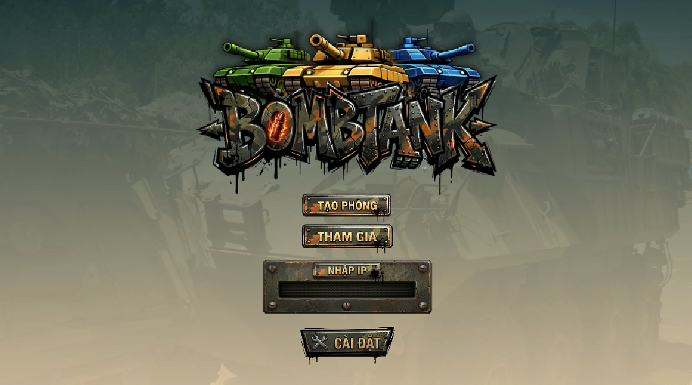

**Cài đặt** — Âm lượng nhạc & SFX

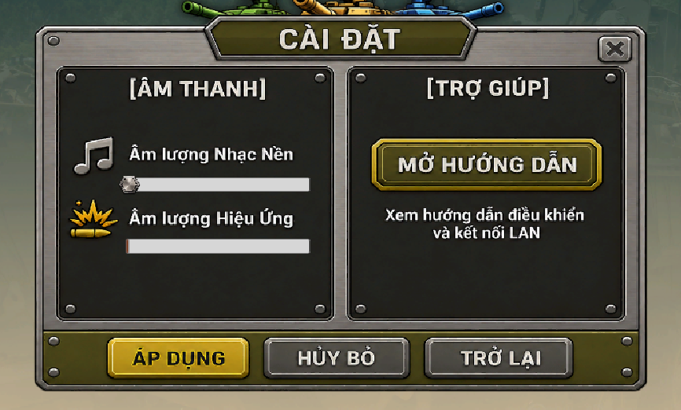

**Hướng dẫn chơi** — Điều khiển, luật coin, chơi LAN

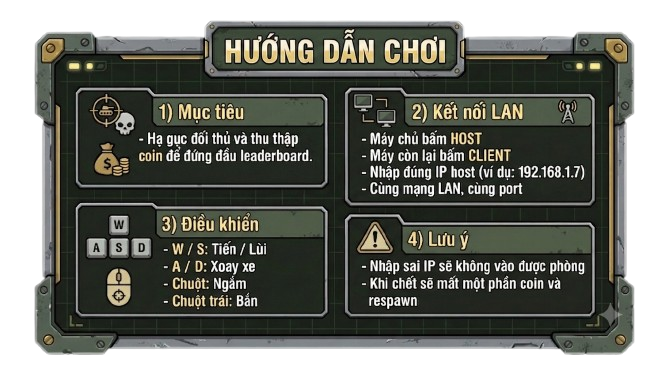

**Popup lỗi kết nối**

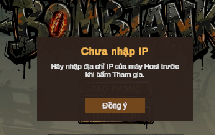

---

### Trong trận

**HUD coin & xu**

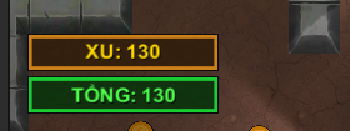

**Bảng xếp hạng & minimap**

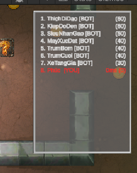

**Gameplay**

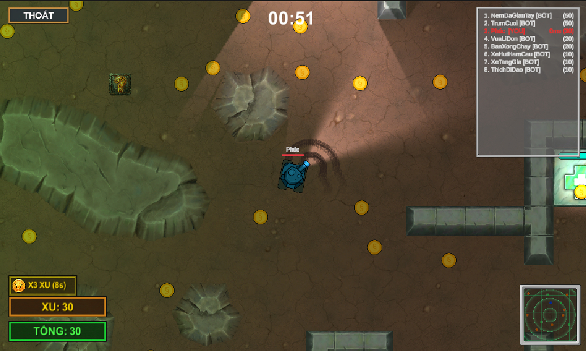

**Item trên map** — Đạn đôi · X3 xu · Bẫy

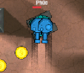
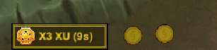
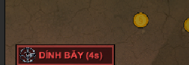

**Popup thoát trận**

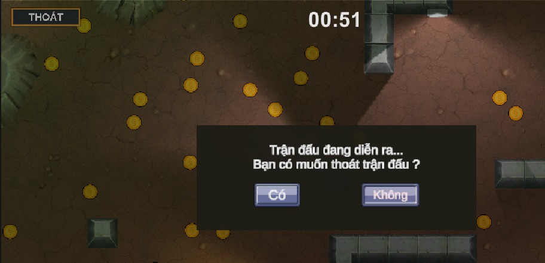

---

### Bản đồ & kết thúc trận

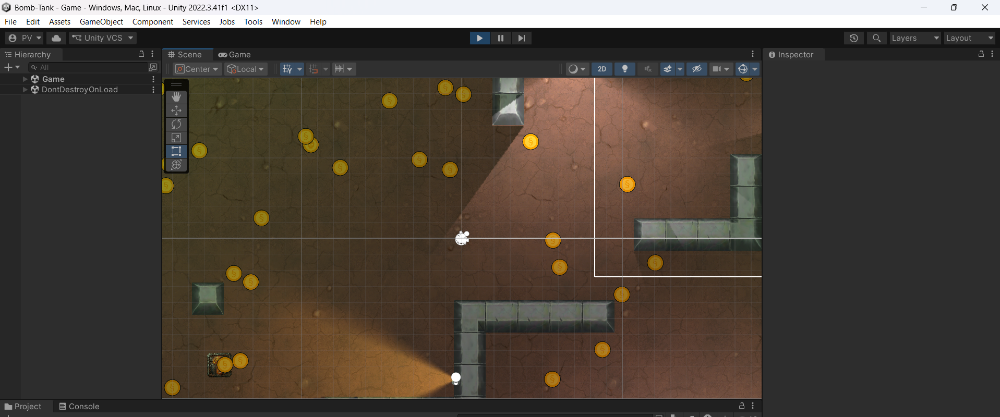

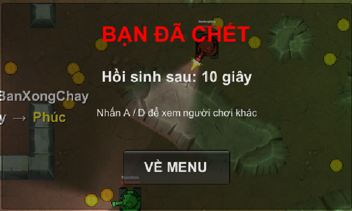

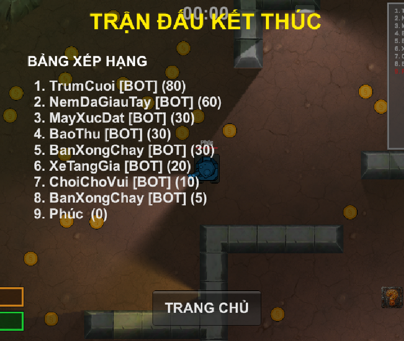

---

### Sơ đồ kỹ thuật

<details>
<summary>Bot AI · Combat · Mạng LAN</summary>

| | |
|---|---|
| 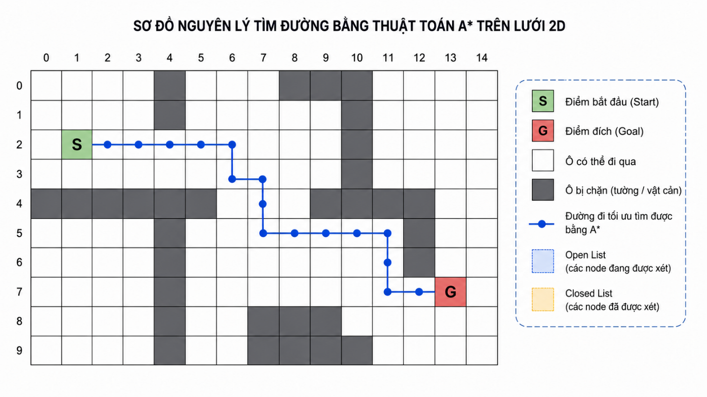 | A* pathfinding |
| 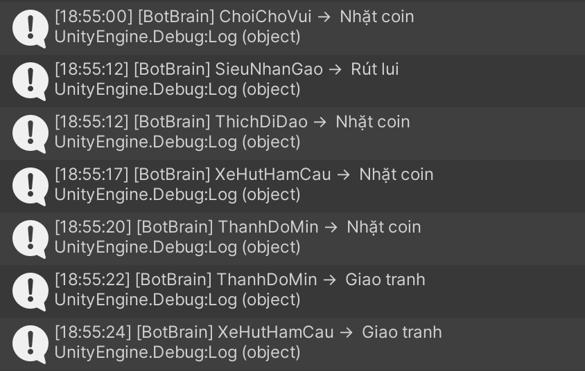 | FSM bot |
| 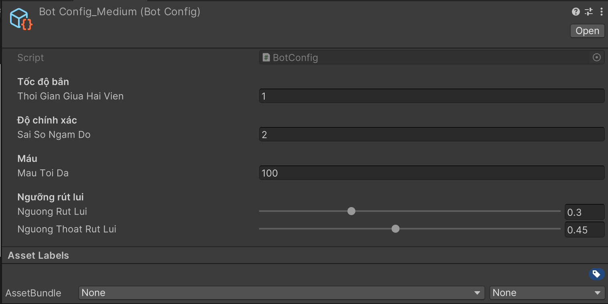 | BotConfig Dễ / Trung |
| 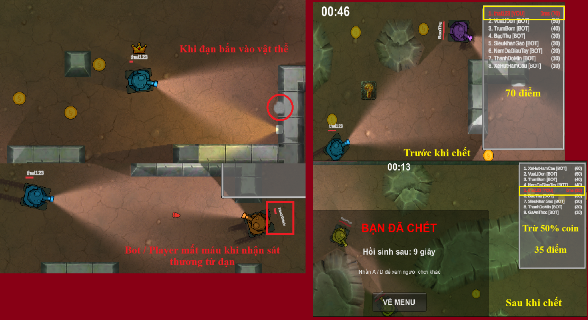 | Xử lý bắn đạn |
| 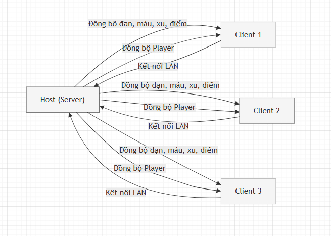 | Netcode + UTP |
| 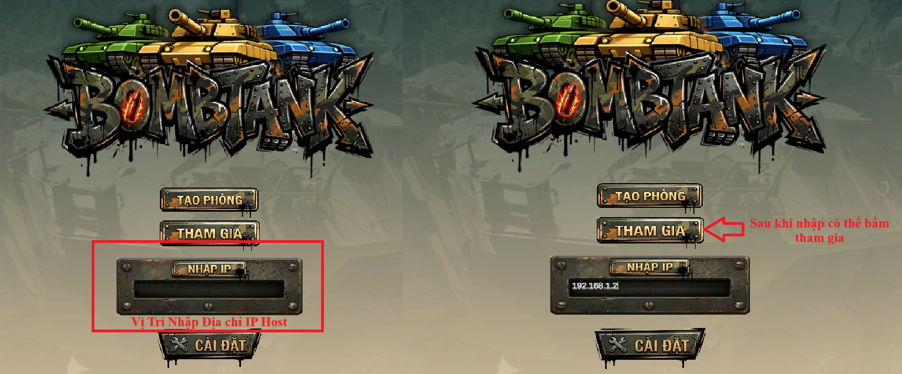 | Kết nối Host–Client |
| 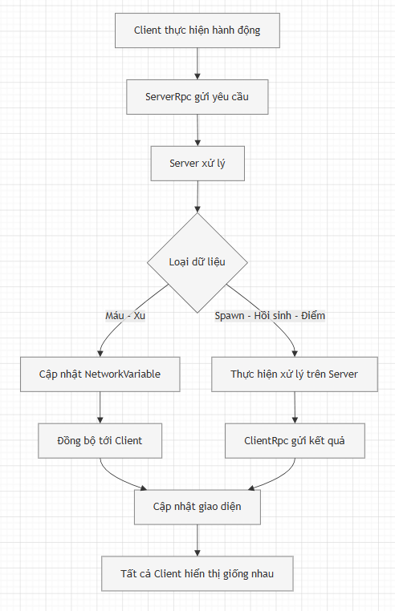 | Đồng bộ dữ liệu |

Các sơ đồ còn lại: `./Docs/screenshots/diagrams/`

</details>

---

## Hướng dẫn cài đặt

**Yêu cầu:** Unity Hub + Editor **2022.3.41f1**, Git

```bash
git clone https://github.com/rosdev29/BombTank-Multiplayer.git
cd BombTank-Multiplayer
```

Mở project bằng Unity Hub → **Add** → chọn thư mục vừa clone, chờ import xong.

---

## Hướng dẫn chạy chương trình

**Solo + bot:** Play từ Bootstrap → nhập tên → **Host**

**LAN (cùng Wi-Fi):**

| Vai trò | Thao tác |
|---------|----------|
| Host | Bấm Host, ghi IP LAN (vd: `192.168.1.10`) |
| Client | Nhập IP host → Join |

Port: **7777**

| Thao tác | Phím |
|----------|------|
| Di chuyển | W A S D |
| Ngắm / Bắn | Chuột / Chuột trái |
| Spectator | A / D |

---

## Kết quả đạt được

- Game tank LAN hoàn chỉnh: host/client, combat, coin, kill feed, timer
- Bot AI FSM + A*, 3 độ khó, tự lấp đủ 8 xe/trận
- UI tiếng Việt, âm thanh, bounty, item, màn kết thúc trận

---

## Hạn chế hiện tại

- Chỉ chơi LAN cùng Wi-Fi, chưa hỗ trợ internet
- Dự án học tập, chưa tối ưu production
- Chưa có tài khoản / lưu tiến trình lâu dài

---

## Hướng phát triển trong tương lai

- Unity Relay / Lobby — chơi qua internet
- Dedicated server, thêm chế độ chơi & map
- Nâng cấp bot AI, leaderboard toàn cục

---

## Phân công nhóm

**Nhóm 11** — Đồ án Trí tuệ Nhân tạo (2026)

| Thành viên | Phụ trách |
|------------|-----------|
| **Lê Triệu Duy (NT)** | Thiết kế map, xây game LAN (tank, coin, combat, menu), kill feed, timer, respawn, ping, quản lý Git & build nộp |
| **Nguyễn Trường An** | Bot brain, FSM, A* pathfinding |
| **Trần Quốc Anh Hoàng** | Spawn bot, điều khiển xe bot, item, UI coin |
| **Nguyễn Thành Lộc** | Trạng thái bot, độ khó, bounty |
| **Nguyễn Chí Thái** | Combat server, cài đặt, bảng xếp hạng, màn kết thúc |
| **Võ Ngọc Phúc** | Tutorial, âm thanh, việt hoá UI |

**Repo:** [github.com/rosdev29/BombTank-Multiplayer](https://github.com/rosdev29/BombTank-Multiplayer)

---

## Tác giả

**Nhóm 11** — Đồ án Trí tuệ Nhân tạo (2026)
